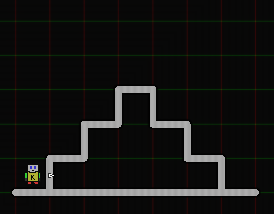
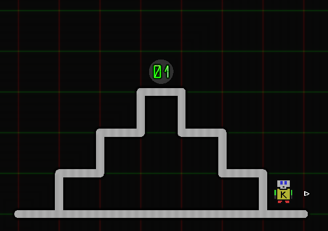
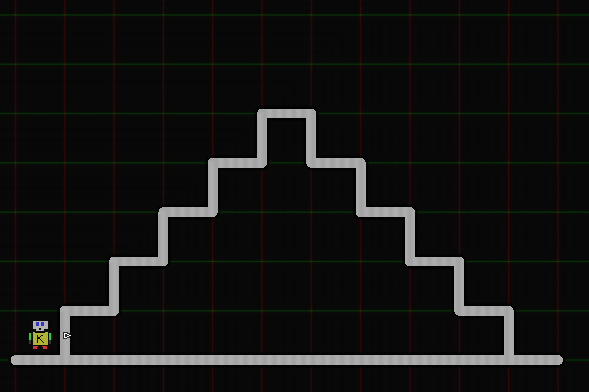

# Karel.js The Robot
# Excercises 

## 1. Stair Climber  
Consider the following world.

Write a program such that karel climbs the 'stairs', and places a beeper at the top, then climbs down, such that the world finishes in this state:

